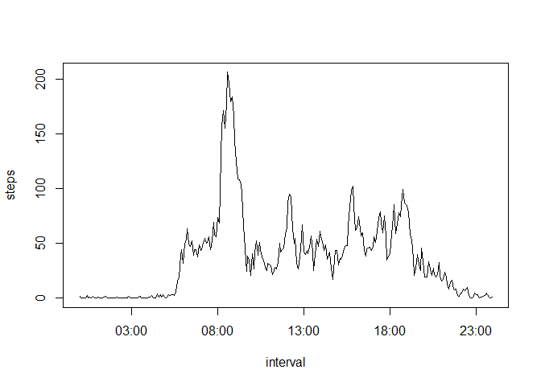
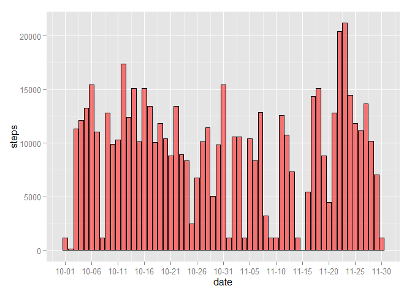
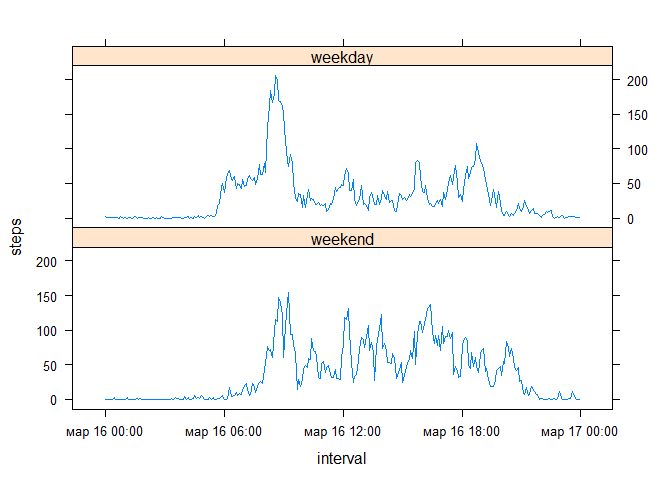

# Reproducible Research - Peer Assessment 1
Voronov Kirill  
Sunday, March 15, 2015  
**Data**

The data consists of two months of data from an anonymous individual collected during the months of October and November, 2012 and include the number of steps taken in 5 minute intervals each day.

Dataset: [Activity monitoring data](https://d396qusza40orc.cloudfront.net/repdata%2Fdata%2Factivity.zip) [52K]

The variables included in this dataset are:

- steps: Number of steps taking in a 5-minute interval (missing values are coded as NA)

- date: The date on which the measurement was taken in YYYY-MM-DD format

- interval: Identifier for the 5-minute interval in which measurement was taken

The dataset is stored in a comma-separated-value (CSV) file and there are a total of 17,568 observations in this dataset.

##Loading and preprocessing the data

1. Load the data


```r
library(dplyr); library(ggplot2); library(lattice); library(scales); library(lubridate)
```


```r
if (!file.exists("data")) {
        dir.create("data")
}

fileUrl <- "http://d396qusza40orc.cloudfront.net/repdata%2Fdata%2Factivity.zip"
download.file(fileUrl, "./data/activity.zip")
activity <- read.csv(unz("./data/activity.zip", "activity.csv"))
```

2. Process/transform the data


```r
activity$date <- as.Date(activity$date, "%Y-%m-%d")
activity$interval <- as.factor(activity$interval)
```

##What is mean total number of steps taken per day?

1. Calculate the total number of steps taken per day


```r
data <- summarise(group_by(activity, date), steps = sum(steps, na.rm = TRUE))

ggplot(data, aes(x=date, y=steps)) +
        geom_histogram(stat="identity", colour="black", fill="red", alpha=0.5) +
        scale_x_date(labels = date_format("%m-%d"), 
                     breaks = seq(min(data$date), max(data$date), 5))
```

 

2. Calculate and report the mean and median of the total number of steps taken per day


```r
mean(data$steps)
```

```
## [1] 9354.23
```

```r
median(data$steps)
```

```
## [1] 10395
```

##What is the average daily activity pattern?

1. Make a time series plot of the 5-minute interval (x-axis) and the average number of steps taken, averaged across all days (y-axis)


```r
data2 <- summarise(group_by(activity, interval), steps = mean(steps, na.rm = TRUE))

times <- format(seq(from = as.POSIXct("2015-02-18 00:00"), 
                    to = as.POSIXct("2015-02-18 23:55"), by = "5 min"), 
                format = "%H:%M")

data2$interval <- as.POSIXct(times, format = "%H:%M")

plot(data2, type = "l")
```

 

2. Which 5-minute interval, on average across all the days in the dataset, contains the maximum number of steps?


```r
format((data2$interval[which.max(data2$steps)]), "%H:%M")
```

```
## [1] "08:35"
```

##Imputing missing values

1. Calculate and report the total number of missing values in the dataset


```r
sum(!complete.cases(activity))
```

```
## [1] 2304
```

2. Create a new dataset that is equal to the original dataset but with the missing data filled in


```r
activity.f <- activity
activity.f$steps[is.na(activity.f$steps)] <- 
        with(activity.f, ave(steps, interval, FUN = function(x) 
                median(x, na.rm = TRUE)))[is.na(activity.f$steps)]
```

3. Make a histogram of the total number of steps taken each day and Calculate and report the mean and median total number of steps taken per day 


```r
data3 <- summarise(group_by(activity.f, date), steps = sum(steps, na.rm = TRUE))

ggplot(data3, aes(x=date, y=steps)) +
        geom_histogram(stat="identity", colour="black", fill="red", alpha=0.5) +
        scale_x_date(labels = date_format("%m-%d"), 
                     breaks = seq(min(data$date), max(data$date), 5))
```

 

```r
mean(data3$steps)
```

```
## [1] 9503.869
```

```r
median(data3$steps)
```

```
## [1] 10395
```

##Are there differences in activity patterns between weekdays and weekends?

1. Create a new factor variable in the dataset with two levels – “weekday” and “weekend” indicating whether a given date is a weekday or weekend day


```r
weekdays1 <- c('понедельник', 'вторник', 'среда', 'четверг', 'пятница')
activity.f$wDay <-  factor((weekdays(activity.f$date) %in% weekdays1)+1L, 
                           levels=1:2, labels=c('weekend', 'weekday'))
```

2. Make a panel plot containing a time series plot of the 5-minute interval (x-axis) and the average number of steps taken, averaged across all weekday days or weekend days (y-axis)


```r
data4 <- summarise(group_by(activity.f, wDay, interval), steps = mean(steps, na.rm = TRUE))
data4$interval<-as.POSIXct(times, format = "%H:%M")
xyplot(steps ~ interval | wDay, data = data4, layout = c(1, 2), type = "l")
```

 
